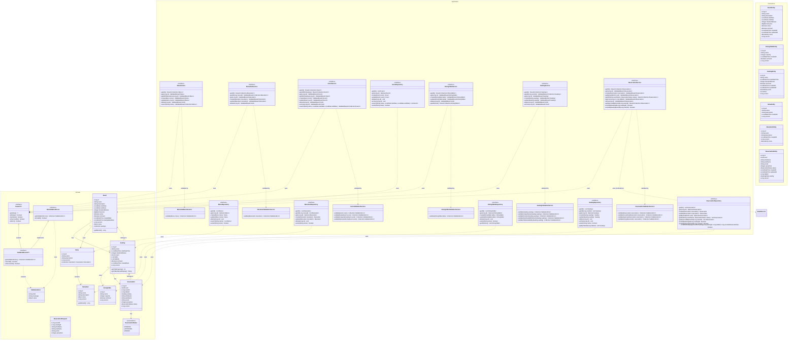

```mermaid

classDiagram
    namespace Domain {

        class Result~T~ {
            <<interface>>
            +getValue() T
            +isEmpty() boolean
            +hasValue() boolean
            +isSuccessful() boolean
            +isError() boolean
        }

        class HasValidationErrors {
            <<interface>>
            +getValidationErrors() Collection~ValidationError~
            +isInvalid() boolean
        }

        class ValidatedResult~T~ {
            <<interface>>
            +getValidationErrors() Collection~ValidationError~
            +isInvalid() boolean
            +isSuccessful() boolean
        }

        class ValidationError {
            +String field
            +String message
            +Object value
        }


        class Event {
            +Long id
            +String name
            +String description
            +LocalDate startDate
            +LocalDate endDate
            +Integer durationMinutes
            +BigDecimal price
            +Boolean active
            +Boolean archived
            +LocalDateTime createdDate
            +LocalDateTime lastUpdatedDate
            +Long version
            +Menu menu
            +Collection<Seating> seatings
            +getMenuId() Long
        }
        
       class DiningTable {
            +Long id
            +String name
            +Integer capacity
            +Boolean archived
            +Long version
        }

       class Seating {
            +Long id
            +String name
            +LocalDateTime startDateTime
            +Integer durationMinutes
            +Event event
            +List<DiningTable> tables
            +List<Long> tableIds
            +Boolean archived
            +LocalDateTime createdDate
            +Long version
            +getTotalCapacity() int
            +getTableNamesDisplay() String
        }

        class Menu {
            +Long id
            +String name
            +String description
            +Long version
            +Collection<MenuItem> menuItems
        }

       class MenuItem {
            +Long id
            +String name
            +String description
            +Menu menu
            +Long version
            +getMenuId() Long
        }

       class Reservation {
            +Long id
            +UUID uuid
            +Long eventId
            +Long tableId
            +Seating seating
            +String firstName
            +String lastName
            +String email
            +Integer groupSize
            +ReservationStatus status
            +Long version
        }
        
        class ReservationRequest {
            +Long eventId
            +Long seatingId
            +String firstName
            +String lastName
            +String email
            +Integer groupSize
        }
        
        class ReservationStatus {
            <<enumeration>>
            +PENDING
            +APPROVED
            +DENIED
        }
        
    }
    
   namespace Application {


    class MenuService {
        <<interface>>
        +getAll() Result~Collection~Menu~~
        +get(Long id) ValidatedResult~Menu~
        +getWithMenuItems(Long id) ValidatedResult~Menu~
        +create(Menu menu) ValidatedResult~Menu~
        +update(Menu menu) ValidatedResult~Menu~
        +delete(Long id) ValidatedResult~Void~
        +search(String name) ValidatedResult~Collection~Menu~~
    }

    class MenuValidationService {
        +validate(Menu menu) Collection~ValidationError~
    }

    class MenuRepository {
        <<interface>>
        +getAll() List~Menu~
        +get(Long id) Optional~Menu~
        +create(Menu menu) Menu
        +update(Menu menu) Menu
        +delete(Long id) void
        +search(String name) List~Menu~
        +exists(String name) boolean
    }


    class MenuItemService {
        <<interface>>
        +getAll() Result~Collection~MenuItem~~
        +getAll(Long menuId) ValidatedResult~Collection~MenuItem~~
        +get(Long id) ValidatedResult~MenuItem~
        +create(MenuItem menuItem) ValidatedResult~MenuItem~
        +update(MenuItem menuItem) ValidatedResult~MenuItem~
        +delete(Long id) ValidatedResult~Void~
    }

    class MenuItemValidationService {
        +validate(MenuItem menuItem) Collection~ValidationError~
    }

    class MenuItemRepository {
        <<interface>>
        +getAll() List~MenuItem~
        +getAll(Long menuId) List~MenuItem~
        +get(Long id) Optional~MenuItem~
        +create(MenuItem menuItem) MenuItem
        +update(MenuItem menuItem) MenuItem
        +delete(Long id) void
        +exists(String name) boolean
    }


    class EventService {
        <<interface>>
        +getAll() Result~Collection~Event~~
        +getAllWithSeating() Result~Collection~Event~~
        +get(Long id) ValidatedResult~Event~
        +getWithSeating(Long id) ValidatedResult~Event~
        +create(Event event) ValidatedResult~Event~
        +update(Event event) ValidatedResult~Event~
        +delete(Long id) ValidatedResult~Void~
        +archive(Long id) ValidatedResult~Void~
        +search(String name, LocalDate startDate, LocalDate endDate) ValidatedResult~Collection~Event~~
    }

    class EventValidationService {
        +validate(Event event) Collection~ValidationError~
        +validateDates(Event event) Collection~ValidationError~
        +validateUniqueName(Event event) Collection~ValidationError~
        +validateMenuAndActive(Event event) Collection~ValidationError~
    }

    class EventRepository {
        <<interface>>
        +getAll() List~Event~
        +get(Long id) Optional~Event~
        +create(Event event) Event
        +update(Event event) Event
        +delete(Long id) void
        +archive(Long id) void
        +search(String name, LocalDate startDate, LocalDate endDate) List~Event~
        +exists(String name) boolean
    }


    class DiningTableService {
        <<interface>>
        +getAll() Result~Collection~DiningTable~~
        +get(Long id) ValidatedResult~DiningTable~
        +create(DiningTable table) ValidatedResult~DiningTable~
        +update(DiningTable table) ValidatedResult~DiningTable~
        +delete(Long id) ValidatedResult~Void~
        +getAllActive() Result~Collection~DiningTable~~
    }

    class DiningTableValidationService {
        +validate(DiningTable table) Collection~ValidationError~
    }

    class DiningTableRepository {
        <<interface>>
        +getAll() List~DiningTable~
        +get(Long id) Optional~DiningTable~
        +create(DiningTable table) DiningTable
        +update(DiningTable table) DiningTable
        +delete(Long id) void
        +exists(String name) boolean
        +getAllActive() List~DiningTable~
    }


    class SeatingService {
        <<interface>>
        +getAll() Result~Collection~Seating~~
        +getAll(Long eventId) ValidatedResult~Collection~Seating~~
        +get(Long id) ValidatedResult~Seating~
        +create(Seating seating) ValidatedResult~Seating~
        +update(Seating seating) ValidatedResult~Seating~
        +delete(Long id) ValidatedResult~Void~
        +archive(Long id) ValidatedResult~Void~
    }

    class SeatingValidationService {
        +validate(Seating seating) Collection~ValidationError~
        +validateUniqueName(Seating seating) Collection~ValidationError~
        +validateDuration(Seating seating) Collection~ValidationError~
        +validateStartDateWithinEvent(Seating seating) Collection~ValidationError~
        +validateTableAvailability(Seating seating) Collection~ValidationError~
    }

    class SeatingRepository {
        <<interface>>
        +getAll() List~Seating~
        +getAll(Long eventId) List~Seating~
        +get(Long id) Optional~Seating~
        +create(Seating seating) Seating
        +update(Seating seating) Seating
        +delete(Long id) void
        +archive(Long id) void
        +exists(String name) boolean
        +getByTableId(Long tableId) List~Seating~
    }


    class ReservationService {
        <<interface>>
        +getAll() Result~Collection~Reservation~~
        +get(Long id) ValidatedResult~Reservation~
        +create(Reservation reservation) ValidatedResult~Reservation~
        +getByUuid(UUID uuid) ValidatedResult~Reservation~
        +getAll(String eventName, ReservationStatus status) Result~Collection~Reservation~~
        +approve(Long id, Long tableId) ValidatedResult~Reservation~
        +deny(Long id) ValidatedResult~Reservation~
        +getApprovedByEventId(Long eventId) Result~Collection~Reservation~~
        +existsBySeatingId(Long seatingId) Boolean
        +existsBySeatingEventId(Long eventId) Boolean
    }

    class ReservationValidationService {
        +validate(Reservation reservation) Collection~ValidationError~
        +validateGroupSize(Reservation reservation) Collection~ValidationError~
        +validateApprove(Reservation reservation) Collection~ValidationError~
        +validateDeny(Reservation reservation) Collection~ValidationError~
    }

    class ReservationRepository {
        <<interface>>
        +getAll() List~Reservation~
        +get(Long id) Optional~Reservation~
        +create(Reservation reservation) Reservation
        +update(Reservation reservation) Reservation
        +getByUuid(UUID uuid) Optional~Reservation~
        +getAll(String eventName, ReservationStatus status) List~Reservation~
        +getApprovedByEventId(Long eventId) List~Reservation~
        +existsBySeatingId(Long seatingId) Boolean
        +existsBySeatingEventId(Long eventId) Boolean
        +isTableAlreadyApprovedForSeating(Long seatingId, Long tableId, Long excludeReservationId) boolean
    }
}

   namespace Persistence {

        class EventEntity {
            +Long id
            +String name
            +String description
            +LocalDate startDate
            +LocalDate endDate
            +Integer durationMinutes
            +BigDecimal price
            +Boolean active
            +Boolean archived
            +LocalDateTime createdAt
            +LocalDateTime updatedAt
            +MenuEntity menu
            +Long version
        }

        class DiningTableEntity {
            +Long id
            +String name
            +Integer capacity
            +LocalDateTime createdAt
            +Boolean archived
            +Long version
        }

        class SeatingEntity {
            +Long id
            +String name
            +LocalDateTime startDateTime
            +Integer durationMinutes
            +Boolean archived
            +LocalDateTime createdAt
            +LocalDateTime updatedAt
            +EventEntity event
            +List<DiningTableEntity> tables
            +Long version
        }

        class MenuEntity {
            +Long id
            +String name
            +String description
            +LocalDateTime createdAt
            +Long version
        }

        class MenuItemEntity {
            +Long id
            +String name
            +String description
            +LocalDateTime createdAt
            +Long version
            +MenuEntity menu
        }

        class ReservationEntity {
            +Long id
            +UUID uuid
            +String firstName
            +String lastName
            +String email
            +Integer groupSize
            +ReservationStatus status
            +LocalDateTime createdAt
            +LocalDateTime updatedAt
            +Long tableId
            +SeatingEntity seating
            +Long version
        }
        
    }

    Event "1" --> "0..*" Seating : has

    Seating "1" --> "1" Event : belongs to

    Seating "0..*" --> "0..*" DiningTable : uses

    Menu "1" --> "0..*" MenuItem : contains

    Event "0..*" --> "1" Menu : uses

    Seating "1" --> "0..*" Reservation : has

    Reservation "1" --> "1" Seating : belongs to

    Reservation --> ReservationStatus : has


%% Application Layer
%% Service -> Result usage
EventService ..> Result : uses
DiningTableService ..> Result : uses
SeatingService ..> Result : uses
MenuService ..> Result : uses
MenuItemService ..> Result : uses
ReservationService ..> Result : uses

%% ReservationService extra dependency
ReservationService ..> EmailService : uses (notifications)

%% Service -> Validation Service dependency
EventService ..> EventValidationService : validated by
DiningTableService ..> DiningTableValidationService : validated by
SeatingService ..> SeatingValidationService : validated by
MenuService ..> MenuValidationService : validated by
MenuItemService ..> MenuItemValidationService : validated by
ReservationService ..> ReservationValidationService : validated by

%% Result Type Hierarchy
Result~T~ <|-- ValidatedResult~T~ : extends

HasValidationErrors <|-- ValidatedResult~T~ : implements

%% Validation structure
HasValidationErrors ..> ValidationError : uses
ValidatedResult~T~ ..> ValidationError : contains

%% Repository Dependencies
EventRepository ..> Event : uses
DiningTableRepository ..> DiningTable : uses
SeatingRepository ..> Seating : uses
MenuRepository ..> Menu : uses
MenuItemRepository ..> MenuItem : uses
ReservationRepository ..> Reservation : uses
```
