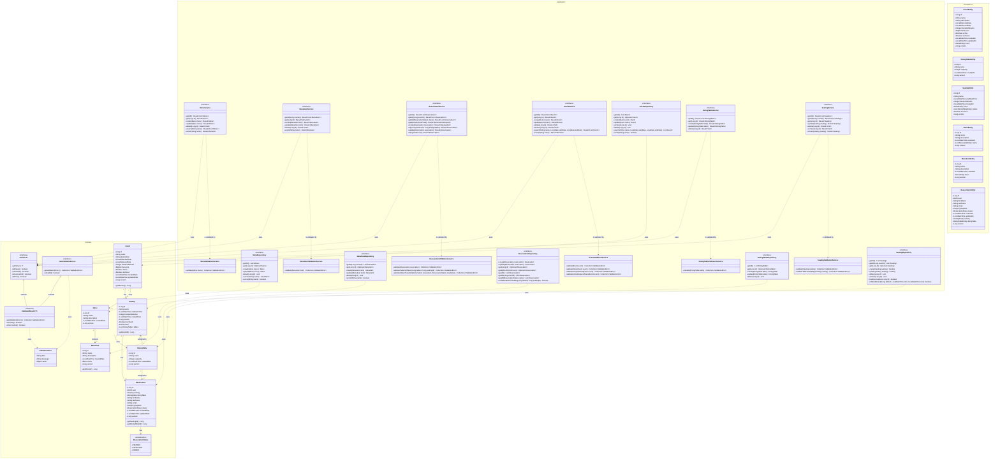

```mermaid
%% Sprint 1

classDiagram
    namespace Domain {

        class Result~T~ {
            <<interface>>
            +getValue() T
            +isEmpty() boolean
            +hasValue() boolean
            +isSuccessful() boolean
            +isError() boolean
        }

        class HasValidationErrors {
            <<interface>>
            +getValidationErrors() Collection~ValidationError~
            +isInvalid() boolean
        }

        class ValidatedResult~T~ {
            <<interface>>
            +getValidationErrors() Collection~ValidationError~
            +isInvalid() boolean
            +isSuccessful() boolean
        }

        class ValidationError {
            +String field
            +String message
            +Object value
        }


        class Event {
            +Long id
            +String name
            +String description
            +LocalDate startDate
            +LocalDate endDate
            +Integer durationMinutes
            +BigDecimal price
            +Boolean active
            +Boolean archived
            +LocalDateTime createdDate
            +LocalDateTime updatedDate
            +Long version
            +getMenuId() Long
        }
        class DiningTable {
            +Long id
            +String name
            +Integer capacity
            +LocalDateTime createdDate
            +Long version
        }

        class Seating {
            +Long id
            +String name
            +LocalDateTime startDateTime
            +Integer durationMinutes
            +LocalDateTime createdDate
            +Long version
            +Boolean archived
            +Event event
            +List~DiningTable~ tables
            +getEventId() Long
        }

        class Menu {
            +Long id
            +String name
            +String description
            +LocalDateTime createdDate
            +Long version
        }

        class MenuItem {
            +Long id
            +String name
            +String description
            +LocalDateTime createdDate
            +Menu menu
            +getMenuId() Long
            +Long version
        }

        class Reservation {
            +Long id
            +UUID uuid
            +Seating seating
            +DiningTable diningTable
            +String firstName
            +String lastName
            +String email
            +Integer groupSize
            +ReservationStatus status
            +LocalDateTime createdDate
            +LocalDateTime updatedDate
            +Long version
            +getSeatingId() Long
            +getDiningTableId() Long
        }
        
        class ReservationStatus {
            <<enumeration>>
            +PENDING
            +APPROVED
            +DENIED
        }
        
    }
    
    namespace Application {

        class MenuService {
            <<interface>>
            +getAll() Result~List~Menu~~
            +get(Long id) Result~Menu~
            +create(Menu menu) Result~Menu~
            +update(Menu menu) Result~Menu~
            +delete(Long id) Result~Void~
            +search(String name) Result~List~Menu~~
            +exists(String name) Result~Boolean~
        }
        
        class MenuValidationService {
            +validate(Menu menu) Collection~ValidationError~
        }
        
        class MenuRepository {
            <<interface>>
            +getAll() List~Menu~
            +get(Long id) Optional~Menu~
            +create(Menu menu) Menu
            +update(Menu menu) Menu
            +delete(Long id) void
            +search(String name) List~Menu~
            +exists(String name) boolean
        }

        class MenuItemService {
            <<interface>>
            +getAll(Long menuId) Result~List~MenuItem~~
            +get(Long id) Result~MenuItem~
            +create(MenuItem item) Result~MenuItem~
            +update(MenuItem item) Result~MenuItem~
            +delete(Long id) Result~Void~
            +exists(String name) Result~Boolean~
        }

        class MenuItemValidationService {
            +validate(MenuItem item) Collection~ValidationError~
        }

        class MenuItemRepository {
            <<interface>>
            +getAll(Long menuId) List~MenuItem~
            +get(Long id) Optional~MenuItem~
            +create(MenuItem item) MenuItem
            +update(MenuItem item) MenuItem
            +delete(Long id) void
            +exists(String name) boolean
        }
        class ReservationService {
            <<interface>>
            +getAll() Result~List~Reservation~~
            +getAll(Long eventId) Result~List~Reservation~~
            +getAll(ReservationStatus status) Result~List~Reservation~~
            +getByUUID(UUID uuid) Result~ReservationRequest~
            +create(Reservation reservation) Result~Reservation~
            +approve(UUID uuid, Long diningTableId) Result~Reservation~
            +update(Reservation reservation) Result~Reservation~
            +deny(UUID uuid) Result~Reservation~
        }

        class ReservationValidationService {
            +validate(Reservation reservation) Collection~ValidationError~
            +validateTableNotTaken(Long tableId, Long seatingId) Collection~ValidationError~
            +validateStatusTransition(Reservation reservation, ReservationStatus newStatus) Collection~ValidationError~
        }

        class ReservationRepository {
            <<interface>>
            +create(Reservation reservation) Reservation
            +update(Reservation reservation) Reservation
            +get(Long id) Optional~Reservation~
            +getByUUID(UUID uuid) Optional~Reservation~
            +getAll() List~Reservation~
            +getAll(Long eventId) List~Reservation~
            +getAll(ReservationStatus status) List~Reservation~
            +isTableTakenForSeating(Long tableId, Long seatingId) boolean
        }
        
        class EventService{
            <<interface>>
            +getAll() Result~List~Event~~
            +get(Long id) Result~Event~
            +create(Event event) Result~Event~
            +update(Event event) Result~Event~
            +delete(Long id) Result~Void~
            +archive(Long id) Result~Void~
            +search(String name, LocalDate startDate, LocalDate endDate) Result~List~Event~~
            +exists(String name) Result~Boolean~            
        }

        class EventValidationService {
            +validate(Event event) Collection~ValidationError~
            +validateDates(Event event) Collection~ValidationError~
            +validateUniqueName(Event event) Collection~ValidationError~
            +validateActiveRequiresMenu(Event event) Collection~ValidationError~
        }

        class EventRepository {
            <<interface>>
            +getAll() List~Event~
            +get(Long id) Optional~Event~
            +create(Event event) Event
            +update(Event event) Event
            +archive(Long id) void
            +delete(Long id) void
            +search(String name, LocalDate startDate, LocalDate endDate) List~Event~
            +exists(String name) boolean
        }


        class DiningTableService {
            <<interface>>
            +getAll() Result~List~DiningTable~~
            +get(Long id) Result~DiningTable~
            +create(DiningTable table) Result~DiningTable~
            +update(DiningTable table) Result~DiningTable~
            +delete(Long id) Result~Void~
        }

        class DiningTableValidationService {
            +validate(DiningTable table) Collection~ValidationError~
        }

        class DiningTableRepository {
            <<interface>>
            +getAll() List~DiningTable~
            +get(Long id) Optional~DiningTable~
            +create(DiningTable table) DiningTable
            +update(DiningTable table) DiningTable
            +delete(Long id) void
        }
        
        class SeatingService {
            <<interface>>
            +getAll() Result~List~Seating~~
            +getAll(Long eventId) Result~List~Seating~~
            +get(Long id) Result~Seating~
            +update(Seating seating) Result~Seating~
            +delete(Long id) Result~Void~
            +archive(Long id) Result~Void~
            +create(Seating seating) Result~Seating~
        }
        
        class SeatingValidationService {
            +validate(Seating seating) Collection~ValidationError~
            +validateTableAvailability(Seating seating) Collection~ValidationError~
        }

        class SeatingRepository {
            <<interface>>
            +getAll() List~Seating~
            +getAll(Long eventId) List~Seating~
            +get(Long id) Optional~Seating~
            +create(Seating seating) Seating
            +update(Seating seating) Seating
            +delete(Long id) void
            +archive(Long id) void
            +hasReservations(Long id) boolean
            +isTableBooked(Long tableId, LocalDateTime start, LocalDateTime end) boolean
        }
    }

    namespace Persistence {
        class EventEntity {
            +Long id
            +String name
            +String description
            +LocalDate startDate
            +LocalDate endDate
            +Integer durationMinutes
            +BigDecimal price
            +Boolean active
            +Boolean archived
            +LocalDateTime createdAt
            +LocalDateTime updatedAt
            +MenuEntity menu
            +Long version
        }

        class DiningTableEntity {
            +Long id
            +String name
            +Integer capacity
            +LocalDateTime createdAt
            +Long version
        }

        class SeatingEntity {
            +Long id
            +String name
            +LocalDateTime startDateTime
            +Integer durationMinutes
            +LocalDateTime createdAt
            +EventEntity event
            +List~DiningTableEntity~ tables
            +Boolean archived
            +Long version
        }
        class MenuEntity {
            +Long id
            +String name
            +String description
            +LocalDateTime createdAt
            +List~MenuItemEntity~ items
            +Long version
        }

        class MenuItemEntity {
            +Long id
            +String name
            +String description
            +LocalDateTime createdAt
            +MenuEntity menu
            +Long version
        }

        class ReservationEntity {
            +Long id
            +UUID uuid
            +String firstName
            +String lastName
            +String email
            +Integer groupSize
            +ReservationStatus status
            +LocalDateTime createdAt
            +LocalDateTime updatedAt
            +SeatingEntity seating
            +DiningTableEntity diningTable
            +Long version
        }
    }

    Event "1" --> "0..*" Seating : has
    Seating "1" --> "1..*" DiningTable : uses
%%    Over time it will be a many to many relationship, since each dining table would have many seating
    DiningTable "0..*" --> "1..*" Seating : assigned to

    Menu "1" --> "0..*" MenuItem : contains
    Event "1" --> "0..1" Menu : uses
    Seating "1" --> "0..*" Reservation : has
    DiningTable "1" --> "0..*" Reservation : assigned to

    Reservation --> ReservationStatus : has

%% Application Layer:
    EventService ..> Result : uses
    DiningTableService ..> Result : uses
    SeatingService ..> Result : uses
    MenuService ..> Result : uses
    MenuItemService ..> Result : uses
    ReservationService ..> Result : uses

    EventService ..> EventValidationService : is validated by
    DiningTableService ..> DiningTableValidationService : is validated by
    SeatingService ..> SeatingValidationService : is validated by
    MenuService ..> MenuValidationService : is validated by
    MenuItemService ..> MenuItemValidationService : is validated by
    ReservationService ..> ReservationValidationService : is validated by

    %% Inheritance Relationships
    Result~T~ <|-- ValidatedResult~T~ : extends
    HasValidationErrors <|-- ValidatedResult~T~ : extends

    %% Dependencies (Returns/Uses)
    HasValidationErrors ..> ValidationError : uses
    ValidatedResult~T~ ..> ValidationError : uses

    %% Repository uses Domain
    EventRepository ..> Event : uses
    DiningTableRepository ..> DiningTable : uses
    SeatingRepository ..> Seating : uses
    MenuRepository ..> Menu : uses
    MenuItemRepository ..> MenuItem : uses
    ReservationRepository ..> Reservation : uses
```
